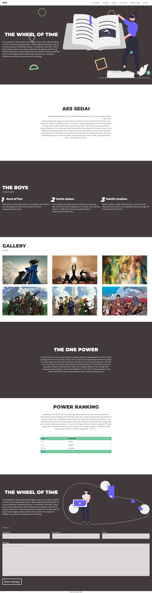

# WOT - Landing-Page

Project made following a online course, applying semantic html, adaptive design, responsive css.

## Table of contents

- [Overview](#overview)
  - [Screenshot](#screenshot)
  - [Links](#links)
- [My process](#my-process)
  - [Built with](#built-with)
  - [What I learned](#what-i-learned)
  - [Useful resources](#useful-resources)
- [Author](#author)


## Overview

### Screenshot



### Links

- [Live site](https://jallanoli.github.io/Wot-Landing-Page/)

## My process

### Built with

- Semantic HTML5 markup
- CSS custom properties
- Flexbox
- CSS Grid
- Inline Javascript

### What I learned

First project made after the course, i consolidated the fundaments of HTML and CSS applying all of the styles and markups on this single project. 

```html
<aside class="menu white-bg">
        <div class="main-content menu-content">
            <h1 onclick="getElementById('close-menu').checked = false;"><a href="#home">WoT</a></h1>
            <nav>
                <ul onclick="getElementById('close-menu').checked = false;">
                    <li><a href="#aessedai">Aes Sedai</a></li>
                    <li><a href="#boys">The Boys</a></li>
                    <li><a href="#gallery">Gallery</a></li>
                    <li><a href="#onepower">One Power</a></li>
                    <li><a href="#power">Power Scaling</a></li>
                    <li><a href="#Contact">Contact</a></li>
                </ul>
            </nav>
        </div>
    </aside>
```
```css
.close-menu-label::after {
        content: '≡';
        position: fixed;
        z-index: 2;
        top: 2rem;
        right: 2rem;
        background: var(--primary-color);
        color: aliceblue;
        font-size: 3rem;
        line-height: 3rem;
        width: 2rem;
        height: 3rem;
        text-align: center;
        padding: 0.5rem;
        cursor: pointer;
    }
```

### Useful resources

- [Grid Quick Guide](https://css-tricks.com/snippets/css/complete-guide-grid/) - Always help me remembering grid semantics and properties. 
- [Flexbox Quick Guide](https://css-tricks.com/snippets/css/a-guide-to-flexbox/) - Always help me remembering Flexbox semantics and properties. 
- [Box Shadow Generator](https://html-css-js.com/css/generator/box-shadow/) - This one is essential for my shadow analysis.

## Author

- Frontend Mentor - [@jAllanOli](https://www.frontendmentor.io/profile/jAllanOli)
- gitHub - [@jAllanOli](https://github.com/jAllanOli)